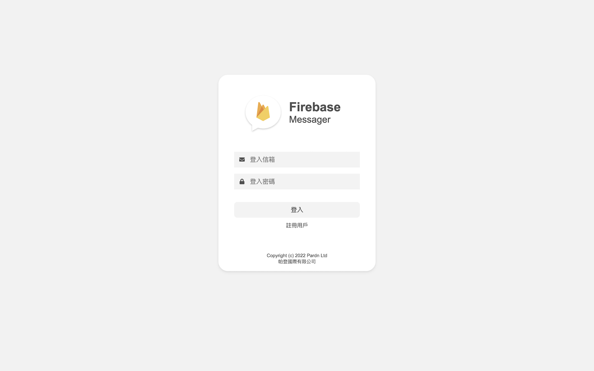
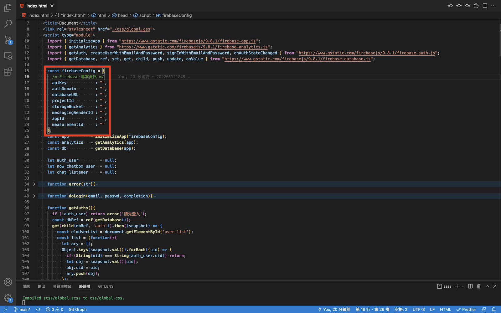

# Firebase Messager (Web)

- 名稱: Firebase Messager (Web)
- 開發: [Pardn Chiu](mailto:chiuchingwei@icloud.com)
- 授權: [MIT License](./LICENSE)
- 狀態: 測試版 (未完整版本)

### 引用

- [firebasejs 9.8.1](https://firebase.google.com/docs/web/setup)
- [fontawesome 5.1](https://fontawesome.com)
### 畫面

| 註冊／登入 |
| --- |
| 

### 導入專案

懂的可以直接略過

| 進入專案頁面 |
| --- |
|  |

| 拷貝專案資訊 |
| --- |
|  |

| 貼上專案資訊 |
| --- |
|  |

