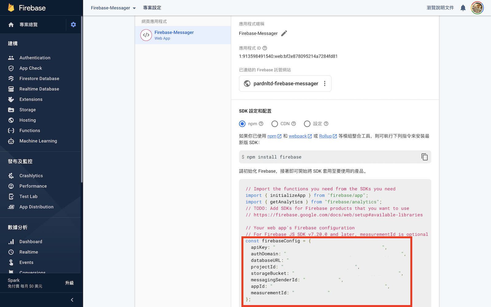

# Firebase Messager

透過 **Firebase** 在 **靜態網頁 (Static Web)** 上打造 **即時訊息 (Realtime Message)** 功能

***

### 介紹

- 名稱: [Firebase Messager (Web ver.)](https://pardnchiu.github.io/firebase-messager-web/)
- 開發: [Pardn Chiu](mailto:chiuchingwei@icloud.com)
- 授權: [MIT License](./LICENSE)
- 狀態: 測試版 (未完整版本)

### 附註

- 下載專案使用需停用本機檔案讀取限制，否則無法讀取 firebase.js。

### 引用

- [firebasejs 9.8.1](https://firebase.google.com/docs/web/setup)
- [fontawesome 5.1](https://fontawesome.com)

### 畫面

| 註冊／登入 |
| --- |
| 

### 導入Firebase

懂的可以直接略過

| 進入專案頁面 |
| --- |
|  |

| 拷貝專案資訊 |
| --- |
|  |

| 貼上專案資訊 |
| --- |
|  |

Copyright (c) 2022 [Pardn Ltd 帕登國際有限公司](mailto:mail@pardn.ltd)